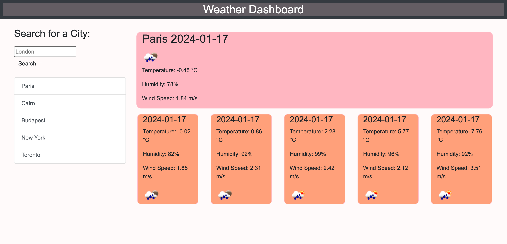

# Weather Dashboard 

##  Description
The aim of this project was to fulfil every task that needed to be done in order for the application to run smoothly. As a complete beginner in this field I am satisfied that the website is showcasing the current weather and a 5 day foreast as well. Previous searches stay on the screen and accessible for user later on.

In addition to the design of the page I utilised bootstrap that allows the page to run on a smartphone and tablet as well without any displaying issues. I added some colours to the page to make the weather search a bit more stylish. 

The pages runs on a free API, that updates the weather every three hour. This can be modified and further developed if the user decides to upgrade for a paid version that updates the time more frequently.

##  Table of Contents
<!-- vscode-markdown-toc -->
*  [Deployed Page](#DeployedPage)
*  [Installation](#Installation)
*  [Credits](#Credits)
*  [License](#License)

<!-- vscode-markdown-toc-config
	numbering=true
	autoSave=true
	/vscode-markdown-toc-config -->
<!-- /vscode-markdown-toc -->

##  Deployed Page

- 

- [Deployed Github Page](https://beatak777.github.io/weather-dashboard/)

##   Installation
No Installation necessary although it is not forbidden to do so. 

If you decide to install 
-> Please use YOUR PERSONAL API key for this as this is important to do so. You can register on the following website. -> [Open Weather Map](https://openweathermap.org/)

Make sure you wait at least two hours before use, this is the required time for the API key to get activated.

Afterwards, open the javascript file and insert your own API on line three. 

<!-- $(document).ready(function () {
    const apiKey = "YOUROWNAPIKEY"; -->

##   Credits

- Default files provided by [edX Bootcamp](https://www.edx.org/course/skills-bootcamp-in-front-end-web-development).

- Table of Contents was Created with the Visual Studio Code Extension 'Markdown TOC' available [here](https://marketplace.visualstudio.com/items?itemName=dumeng.markdown-toc).

- Sample codes were utilised for JS code from [Open Weather Map Test Site](https://osp123.github.io/tutorials/html/weatherAPI.html).

##   License
MIT License.
For further information please refer to the LICENSE in the repo.